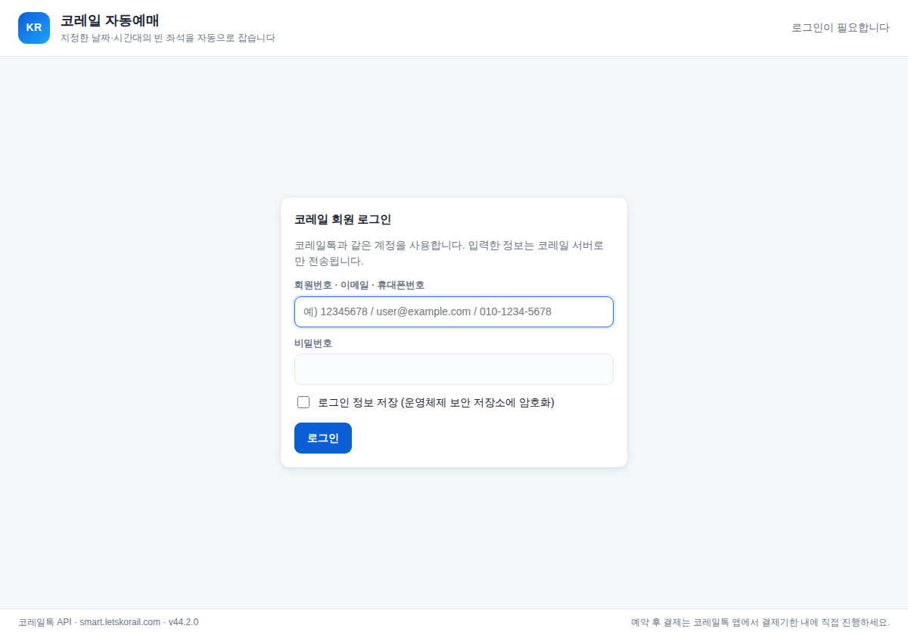
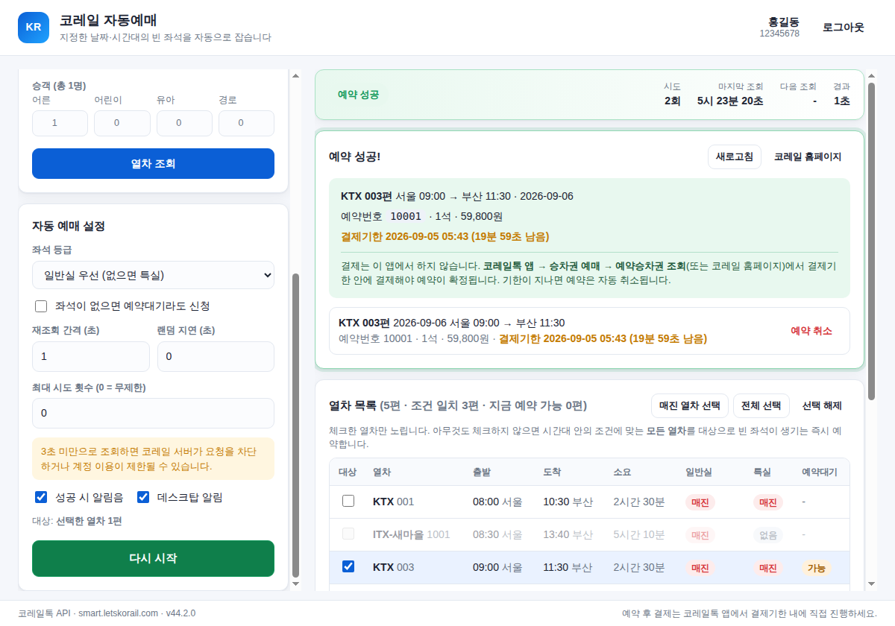

# 코레일 자동예매 (Korail Auto Booking)

지정한 날짜·시간대의 **매진된 열차에 빈 좌석이 생기는 즉시 자동으로 예약**하는 데스크탑 앱입니다.
코레일+ (구 코레일톡) 회원 계정으로 로그인해 KTX·ITX·새마을·무궁화 승차권을 자동 예매합니다.

> Electron + React + TypeScript. 코레일 서버와만 통신하며, 로그인 정보는 이 컴퓨터 밖으로 나가지 않습니다.

<p>
  
  
</p>

---

## ⚠️ 먼저 읽어 주세요

- **결제는 이 앱이 하지 않습니다.** 이 앱은 좌석을 **예약(선점)** 까지만 합니다. 예약 후에는
  **코레일+ 앱 → 승차권 예매 → 예약승차권 조회**(또는 코레일 홈페이지)에서 **결제기한 안에 직접 결제**해야
  예약이 확정됩니다. 결제기한(보통 10분, 출발 20분 전부터는 5분)이 지나면 예약은 자동 취소됩니다.
- **코레일 매크로 방지 정책.** 코레일은 2025년부터 매크로 탐지 솔루션을 운영하며, 짧은 간격의 반복
  조회를 매크로로 간주해 **로그인·조회 단계에서 차단**하거나 계정 이용을 제한할 수 있습니다.
  적발 시 30분 예매 제한 → 1개월 제한 → 회원 강제 탈퇴(삼진아웃)로 이어집니다. **조회 간격을 넉넉히
  두고(기본 4초, 최소 3초 권장), 명절 예매 등 혼잡 시간대에는 사용을 자제하세요.** 사용에 따른 책임은
  사용자 본인에게 있습니다.
- 이 프로그램은 코레일의 공식 제품이 아니며, 개인적·학습 목적의 도구입니다. 코레일이 API나 앱 무결성
  검사(DynaPath)를 바꾸면 동작하지 않을 수 있습니다. 아래 **문제 해결**을 참고하세요.

---

## 주요 기능

- **자동 예매**: 출발/도착역, 날짜, 출발 시간대(부터~까지), 열차 종류, 승객 수를 지정하면 매진되지 않은
  좌석을 반복 조회해 생기는 즉시 예약합니다.
- **대상 지정**: 조회한 열차 목록에서 특정 열차만 체크해 노리거나, 아무것도 체크하지 않고 시간대 안의
  조건에 맞는 **모든 열차**를 대상으로 삼을 수 있습니다.
- **좌석 등급 우선순위**: 일반실 우선 / 일반실만 / 특실 우선 / 특실만. 좌석이 없으면 **예약대기** 신청 옵션.
- **세션 자동 복구**: 예매 중 세션이 만료되면 자동으로 다시 로그인해 계속 진행합니다.
- **성공 알림**: 데스크탑 알림 + 알림음 + 예약번호·결제기한 표시. 예약 취소도 앱에서 가능합니다.
- **안전한 로그인 저장**: "로그인 정보 저장"을 켜면 운영체제 보안 저장소(Windows DPAPI / macOS 키체인)로
  비밀번호를 암호화해 보관합니다. 평문으로 저장하지 않습니다.

## 다운로드 / 설치

설치 파일은 이 저장소의 **[Releases](https://github.com/goproide-ai/portfolio/releases)** 페이지에서 받을 수 있습니다
(`korail-v*` 태그). 코드 서명 인증서 없이 빌드하므로 처음 실행할 때 운영체제 경고가 뜹니다.

| OS | 파일 | 처음 실행 |
| --- | --- | --- |
| Windows 10/11 | `korail-auto-booking-<버전>-win-x64.exe` (설치본) / `...-win-x64-portable.exe` (무설치) | SmartScreen 창에서 **추가 정보 → 실행** |
| macOS 12+ | `...-mac-arm64.dmg` (Apple Silicon) / `...-mac-x64.dmg` (Intel) | 서명되지 않은 앱이라 "손상됨"으로 표시됩니다. 처음 실행 전 터미널에서 `xattr -cr "/Applications/Korail Auto Booking.app"` |
| Linux | `...-linux-x86_64.AppImage` | `chmod +x` 후 실행 |

## 요구 사항 (소스에서 실행할 때)

- Node.js 22.12 이상
- Windows 10+, macOS 12+, 또는 Linux (X11/Wayland)
- 코레일+ (구 코레일톡) 회원 계정

## 설치와 실행 (개발 모드)

```bash
cd korail-auto-booking
npm install
npm run dev      # 개발 모드로 앱 실행 (Vite HMR)
```

## 사용법

1. **로그인** — 회원번호(8자리) · 이메일 · 휴대폰번호(하이픈 포함) 중 하나와 비밀번호로 로그인합니다.
2. **조회 조건 입력** — 출발/도착역(자동완성), 날짜, 출발 시간대, 열차 종류, 승객 수를 정하고 **열차 조회**를
   누릅니다.
3. **대상 선택** — 목록에서 노릴 열차를 체크합니다(선택하지 않으면 시간대 내 조건에 맞는 모든 열차 대상).
   매진 열차만 한 번에 선택하는 버튼도 있습니다.
4. **자동 예매 시작** — 좌석 등급·예약대기 여부·재조회 간격을 정하고 **자동 예매 시작**을 누릅니다. 빈 좌석이
   생기면 즉시 예약하고, 성공하면 알림과 함께 **예약번호·결제기한**을 보여 줍니다.
5. **결제** — 코레일+ 앱 또는 코레일 홈페이지에서 결제기한 안에 결제해 예약을 확정합니다.

## 스크립트

| 명령 | 설명 |
| --- | --- |
| `npm run dev` | 개발 모드 실행 |
| `npm run build` | `out/`에 메인·프리로드·렌더러 번들 빌드 |
| `npm test` | 단위 테스트 (Vitest) |
| `npm run typecheck` | 메인·렌더러 타입 검사 |
| `npm run e2e` | 실제 Electron + 모의 코레일 서버로 종단(E2E) 테스트 |
| `npm run dist` | 현재 OS용 설치 파일 패키징 (electron-builder) |
| `npm run dist:win` / `dist:mac` / `dist:linux` | 특정 OS용 패키징 |

> 리눅스에서 디스플레이가 없으면 E2E는 `xvfb-run -a npm run e2e`로 실행하세요.
> 패키징된 앱을 검증하려면 `E2E_ELECTRON_EXECUTABLE=release/linux-unpacked/korail-auto-booking npm run e2e`처럼
> 실행 파일을 지정합니다 (릴리스 워크플로가 Linux 빌드에 대해 이 검사를 자동으로 수행합니다).

## 배포용 패키지 만들기

```bash
npm run dist            # 현재 OS
npm run dist:win        # Windows용 (NSIS 설치본 + 포터블)
npm run dist:mac        # macOS용 (dmg + zip)
```

설치 파일은 `release/`에 생성됩니다. 설정은 `electron-builder.yml`을 참고하세요.
앱 아이콘은 `node scripts/make-icon.mjs`로 다시 생성할 수 있습니다.

### 릴리스 만들기 (GitHub Actions)

`korail-v*` 태그를 푸시하면 `.github/workflows/korail-release.yml`이 Windows·macOS·Linux 설치 파일을
빌드해 **초안(draft) 릴리스**에 첨부합니다. Releases 페이지에서 내용을 확인하고 **Publish release**를 누르면 공개됩니다.

```bash
# package.json의 version을 올린 뒤
git tag korail-v0.1.0
git push origin korail-v0.1.0
```

PR과 푸시마다 `.github/workflows/korail-ci.yml`이 타입 검사·단위 테스트·빌드·종단 테스트를 실행합니다.

## 구조

```
src/
  shared/            메인·렌더러 공용 타입, 역 목록, 열차 분류 유틸
  main/
    korail/          코레일 API 클라이언트
      client.ts        로그인·조회·예약·취소 (POST 폼, 쿠키 세션)
      dynapath.ts      x-dynapath-m-token 매크로 방지 토큰 생성기
      crypto.ts        비밀번호 AES 암호화 + Sid 생성
      constants.ts     엔드포인트·버전·코드값 (한곳에서 관리)
      parse.ts         응답(h_* 키) → 타입 객체 변환
    booking/
      engine.ts        폴링·재시도·세션복구 자동 예매 엔진
      matcher.ts       시간대·종류·좌석 조건 필터
    store/             설정 저장, safeStorage 로그인 저장
    ipc.ts, index.ts   IPC 핸들러, 메인 프로세스 진입점
  preload/           contextBridge로 렌더러에 노출하는 안전한 API
  renderer/          React UI (로그인·조회·자동예매·로그·예약)
test/                단위 테스트 (crypto, dynapath, client, engine, parse, matcher)
e2e/                 모의 코레일 서버 + Playwright 종단 테스트
```

## 동작 방식 (코레일 API)

- 호스트 `smart.letskorail.com`, 경로 `.../classes/com.korail.mobile.*`.
- **로그인**: `common.code.do`로 1회용 AES 키를 받아 비밀번호를 암호화(AES-CBC → 이중 Base64)한 뒤
  `login.Login`에 전송. 세션은 `JSESSIONID` 쿠키로 유지됩니다.
- **매크로 방지(DynaPath)**: 로그인·조회·예약 요청에는 앱이 만드는 `x-dynapath-m-token` 헤더와 `Sid`
  값이 필요합니다. 이 앱은 공개된 리버스 엔지니어링(yakisoba0728/korail-mobile-api 등)을 바탕으로 같은
  토큰을 재현하며, 단위 테스트가 참조 구현과 바이트 단위로 일치함을 검증합니다.
- **조회**: `seatMovie.ScheduleView` (한 번에 최대 10편). 시간대가 넓으면 마지막 열차 다음 시각으로
  재조회하며 창을 훑습니다.
- **예약/취소**: `certification.TicketReservation` / `reservationCancel.ReservationCancelChk`.

가장 자주 바뀌는 값(앱 버전 `Version`, 기기 문자열)은 `src/main/korail/constants.ts`에 모아 두었습니다.

## 문제 해결

- **로그인이 "MACRO ERROR" 또는 앱 업데이트 안내로 막힘** — 코레일이 앱 버전을 올렸을 수 있습니다.
  `src/main/korail/constants.ts`의 `API_VERSION`을 최신 코레일+ 버전 문자열로 바꾼 뒤 다시 빌드하세요
  (예: `250601003`). DynaPath 토큰 형식 자체가 바뀌면 `dynapath.ts` 갱신이 필요할 수 있습니다.
- **"로그인 암호화 키를 받지 못했습니다"** — 코레일이 로그인 응답 형식을 바꿨을 수 있습니다.
- **"비밀번호가 틀렸습니다"인데 맞음** — 휴대폰번호로 로그인할 때는 반드시 하이픈(`010-1234-5678`)을 넣으세요.
- **조회는 되는데 예약이 계속 실패** — 이미 다른 사람이 좌석을 가져간 경우입니다(정상). 계속 재조회합니다.
- **자꾸 차단됨** — 재조회 간격을 늘리고, 짧은 시간에 반복 사용을 피하세요.

## 개발용 환경 변수

| 변수 | 용도 |
| --- | --- |
| `KORAIL_API_BASE` | 코레일 호스트 대신 다른 base URL로 요청 (테스트용) |
| `KORAIL_USER_DATA` | 설정·로그인 저장 위치 (테스트용 격리 프로필) |
| `KORAIL_DEBUG` | 메인 프로세스에 요청 로그 출력 (비밀번호·키는 가려짐) |

## 라이선스

MIT. 개인 학습용 도구이며, 코레일 이용약관과 관련 법규를 준수해 사용하세요.
